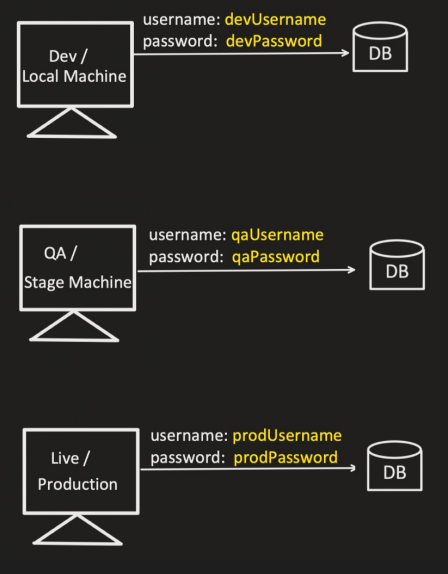

# @Profile

### Question
You have 2 applications and 1 common codebase, how will you make sure that Bean is created only for 1 application and not for other. <br>
Few suggest @ConditionalOnProperty annotation and few suggest @Profile annotation. <br>
In general: <br>
Yes, using both we can achieve this requirement. But, @Profile is technically intended for **environment separation** rather than application specific bean creation. <br>
    

The "username" and "password" is just one example.
There are so many other configuration, which are different for different environments, like: 
- URL and Port Number
- Connection Timeout Values
- Request Timeout Values
- Throttle Values
- Retry Values

We put the configurations in "application.properties" file. But how to handle, different environment configurations? <br>
That's where Profiling comes into play

application.properties
- application-{profile1}.properties
- application-{profile2}.properties
- application-{profileN}.properties

#### Example
```java
@Component
public class MySQLConnection {
    @Value("${username}")
    String username;
    
    @Value("${password}")
    String password;
            
    @PostConstruct
    public void init() {
        System.out.println("username: " + username + " password: " + password);
    }
}
```

#### application.properties
```
username=defaultUsername
password=defaultPassword
```

#### application-dev.properties
```
username=devUsername
password=devPassword
```

#### application-qa.properties
```
username=qaUsername
password=qaPassword
```

#### application-prod.properties
```
username=prodUsername
password=prodPassword
```

#### Console
```
username: defaultUsername password: defaultPassword
```

And during application startup, we can tell spring boot to pick specific "application.properties" file, using "spring.profiles.active" configuration.

#### application.properties
```
username=defaultUsername
password=defaultPassword
spring.profiles.active=qa
```

#### Console
```
username: qaUsername password: qaPassword
```

We can pass the value to this configuration "spring.profiles.active" during application startup itself: `mvn spring-boot:run -Dspring-boot.run.profiles=prod` <br>
OR <br>

Add this to pom.xml <br>
```xml
<profiles>
    <profile>
        <id>local</id>
        <properties>
            <spring-boot.run.profiles>dev</spring-boot.run.profiles>
        </properties>
    </profile>
    <profile>
        <id>production</id>
        <properties>
            <spring-boot.run.profiles>prod</spring-boot.run.profiles>
        </properties>
    </profile>
    <profile>
        <id>stage</id>
        <properties>
            <spring-boot.run.profiles>qa</spring-boot.run.profiles>
        </properties>
    </profile>
</profiles>
```

Run this command: `mvn spring-boot:run -Pproduction`

#### Console
```
username: prodUsername password: prodPassword
```

---------

Using @Profile annotation, we can tell Spring Boot to create bean only when particular profile is set.
#### Example
```java
@Component
@Profile("prod")
public class MySQLConnection {
    @Value("${username}")
    String username;
    
    @Value("${password}")
    String password;
    
    @PostConstruct
    public void init() {
        System.out.println("MySQL username: " + username + " password: " + password);
    }
}
```

```java
@Component
@Profile("dev")
public class MySQLConnection {
    @Value("${username}")
    String username;
    
    @Value("${password}")
    String password;
    
    @PostConstruct
    public void init() {
        System.out.println("MySQL username: " + username + " password: " + password);
    }
}
```

#### application.properties
```
username=defaultUsername
password=defaultPassword
spring.profiles.active=qa
```

#### application-dev.properties
```
username=devUsername
password=devPassword
```

#### application-qa.properties
```
username=qaUsername
password=qaPassword
```

#### application-prod.properties
```
username=prodUsername
password=prodPassword
```

Run this command: `mvn spring-boot:run -Dspring-boot.run.profiles=prod` <br>

#### Console
```
username: prodUsername password: prodPassword
```

### We can also set multiple profiles at a time
#### Example
```java
@Component
@Profile("prod")
public class MySQLConnection {
    @Value("${username}")
    String username;
    
    @Value("${password}")
    String password;
    
    @PostConstruct
    public void init() {
        System.out.println("MySQL username: " + username + " password: " + password);
    }
}
```

```java
@Component
@Profile("dev")
public class MySQLConnection {
    @Value("${username}")
    String username;
    
    @Value("${password}")
    String password;
    
    @PostConstruct
    public void init() {
        System.out.println("MySQL username: " + username + " password: " + password);
    }
}
```

It will always consider the last one (by default)

#### application.properties
```
username=defaultUsername
password=defaultPassword
spring.profiles.active=prod,qa
```

#### application-dev.properties
```
username=devUsername
password=devPassword
```

#### application-qa.properties
```
username=qaUsername
password=qaPassword
```

#### application-prod.properties
```
username=prodUsername
password=prodPassword
```

#### Console
```
MySql username: qaUsername password: qaPassword
NoSql username: qaUsername password: qaPassword
```

