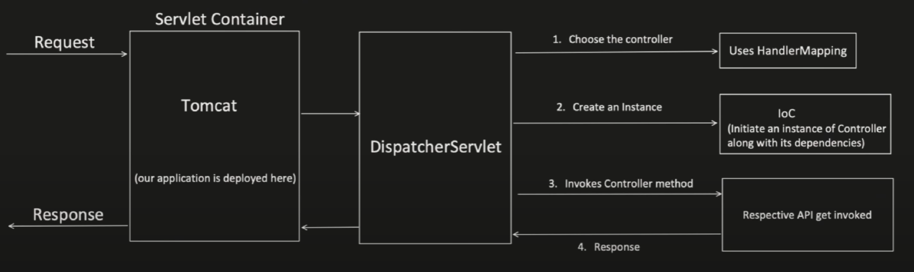

# Custom Interceptors in Spring Boot

### Interceptor
It's a mediator, which gets involved before or after the actual code.

### Custom Interceptor for Requests Before Even Reaching to Specific Controller Class


```java
@RestController
@RequestMapping(value = "/api")
public class UserController {
    @Autowired
    private User user;
    
    @GetMapping(path = "/getUser")
    public String getUser() {
        user.getUser();
        return "success";
    }
}
```

```java
@Component
public class MyCustomInterceptor implements HandlerInterceptor {
    @Override
    public boolean preHandle(HttpServletRequest request, HttpServletResponse response, Object object) {
        System.out.println("Inside pre handle method.");
        return true;
    }
    
    @Override
    public void postHandle(HttpServletRequest request, HttpServletResponse response, Object object) {
        System.out.println("Inside post handle method.");
    }
    
    @Override
    public void afterCompletion(HttpServletRequest request, HttpServletResponse, Object object) {
        System.out.println("Inside after completion method.")
    }
}
```

```java
@Configuration
public class AppConfig implements WebMvcConfigurer {
    @Autowired
    private MyCustomInterceptor myCustomInterceptor;
    
    @override
    public void addInterceptors(InterceptorRegistry registry) {
        registry.addInterceptor(myCustomInterceptor)
                .addPatPatterns("/api/*")
                .excludePathPatterns("/api/updateUser", "/api/deleteUser");
    }
}
```

#### Output
```
inside pre handle method
hitting db to get the userdata
inside post handle method
inside after completion method
```

### Custom Interceptor for Requests After Reaching to Specific Controller Class
#### Step 1: Creation of Custom Annotation
We can create Custom Annotation using keyword `@interface` java annotation.
```java
public @interface MyCustomAnnotation {
    
}

public class User {
    @MyCustomAnnotation
    public void updateUser() {
        //some business logic
    }
}
```

Two Important Meta Annotation properties are:
- `@Target`: this meta annotation, tells where we can apply the particular annotation on method or class or constructor
    ```java
    @Target(ElementType.METHOD)
    public @interface MyCustomAnnotation {}
    ```
    ```java
    @Target({ElementType.CONSTRUCTOR, ElementType.METHOD, ElementType.PARAMETER, ElementType.FIELD})
    public @interface MyCustomAnnotation {}
    ```
  - `@Retention`: this meta annotation tell, how the particular annotation will be stored in Java.
      - `RetentionPolicy.SOURCE`: Annotation will be discarded by compiler itself and its not even recorded in .class file.
        - ```java
          @Target({ElementType.METHOD})
          @Retention(RetentionPolicy.SOURCE)
          public @interface MyCustomAnnotation {}
          ``` 
          ```java
          public class User {
            @MyCustomAnnotation
            public void updateUser() {
                //some business logic
            }
          }
          ```
          ```java
          public class User {
            public User() {}
            public void updateUser() {}
          }
          ```
      - `RetentionPolicy.CLASS`: Annotation will be recorded in .class file but ignored by JVM during run time.
      - `RetentionPolicy.RUNTIME`: Annotation will be recorded in .class file and also available during run time.
        - ```java
          @Target({ElementType.METHOD})
          @Retention(RetentionPolicy.RUNTIME)
          public @interface MyCustomAnnotation {}
          ```
          ```java
          public class User {
            @MyCustomAnnotation
            public void updateUser() {
                //some business logic
            }
          }
          ```
          ```java
          public class User {
            public User() {}
            @MyCustomAnnotation
            public void updateUser() {}
          }
          ```

How to create Custom Annotation with methods (more like a fields):
- No parameter, no body
- Return type is restricted to:
  - Primitive type(int, boolean, double, etc)
  - String
  - Enum
  - Class<?>
  - Annotations
  - Array of above types

```java
@Target({ElementType.METHOD})
@Retention(RetentionPolicy.RUNTIME)
public @interface MyCustomAnnotation {
    String key() default "defaultKeyName";
}
```

```java
public class User {
    public User() {}
    @MyCustomAnnotation(key = "userKey")
    public void updateUser() {
        //some business logic
    }
}
```

```java
@Target({ElementType.METHOD})
@Retention(RetentionPolicy.RUNTIME)
public @interface MyCustomAnnotation {
    int intKey() default 0;
    String stringKey() default "defaultString";
    Class<?> classTypeKey() default String.class;
    MyCustomEnum enumKey() default MyCustomEnum.ENUM_VALUE;
    String[] stringArrayKey() default {"default1", "default2"};
    int[] intArrayKey() default {1, 2};
}
```

```java
public class User {
    @MyCustomAnnotation(intKey = 10, stringKey = "user", classTypeKey = User.class, enumKey = MyCustomEnum.ENUM_VAL2)
    public void updateUser() {
        //some business logic
    }
}
```

#### Step 2: Creation of Custom Interceptor
```java
@RestController
@RequestMapping(value = "/api/")
public class UserController {
    @Autowired
    User user;
    
    @GetMapping(path = "/getUser")
    public String getUser() {
        user.getUser();
        return "Success";
    }
}
```

```java
@Target({ElementType.METHOD})
@Retention(RetentionPolicy.RUNTIME)
public @interface MyCustomAnnotation {
    String name() default "";
}
```

```java
@Component
public class User {
    @MyCustomAnnotation(name = "user")
    public void getUser() {
        System.out.println("Get the user details.");
    }
}
```

```java
@Component
@Aspect
public class MyCustomInterceptor {
    @Around("@annotation(com.conceptandcoding.learningspringboot.CustomInterceptor.MyCustomAnnotation") //pointcut expression
    public void invoke(ProceedingJoinPoint joinPoint) throws Throwable { //throwable
        System.out.println("Do something before actual method.");
        Method method = ((MethodSignature)joinPoint.getSignature()).getMethod();
        if(method.isAnnotationPresent(MyCustomAnnotation.class)) {
            MyCustomAnnotation annotation = method.getAnnotation(MyCustomAnnotation.class);
            System.out.println("Name from annotation: " + annotation.name());
        }
        joinPoint.proceed();
        System.out.println("Do something after actual method.");
    }
}
```

#### Output
```
Do something before actual method
Name from annotation: user
Get the user details
Do something after actual method
```


