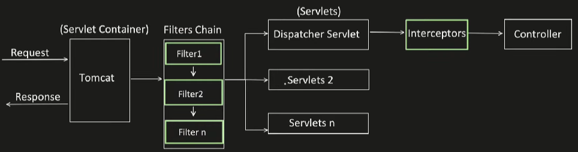

# Filters vs Interceptors

### Filters
It intercepts the HTTP request and response, before they reach to the servlet.

### Interceptors
It's specific to spring framework, and intercept HTTP request and response, before they reach to the controller.


### Servlet
- Servlet is nothing but a Java class which accepts the incoming request, process it and returns the response.
- We can create multiple servlets like:
  - Servlet 1: can be configured to handle REST APIs
  - Servlet 2: can be configured to handle SOAP APIs etc.
- Similarly like this, **"DispatcherServler"** is kind of servlet provided by Spring, and by default its configured to handle all the APIs **"/*"**

### Filter
- Filter is used when we want to intercept HTTP Request and Response and add logic agnostic of the underlying servlets.
- We can have many filters and have ordering between them too.

### Interceptor
- It's used when we want to intercept HTTP Request and Response and add logic specific to a particular servlet.
- We can have many interceptors and have ordering between them too.

### Multiple Interceptors and It's Ordering
If **"preHandle"** returns false, next filter and controller will not get invoked.

```java
@Configuration
public class AppConfig implements WebMvcConfigurer {
    @Autowired
    private MyCustomInterceptor myCustomInterceptor1;
    
    @Autowired
    private MyCustomInterceptor myCustomInterceptor2;

    @override
    public void addInterceptors(InterceptorRegistry registry) {
        //below order is maintained while calling interceptors
        registry.addInterceptor(myCustomInterceptor1)
                .addPatPatterns("/api/*") //apply to these URL patterns
                .excludePathPatterns("/api/updateUser", "/api/deleteUser"); //exclude for these URL patterns
        
        registry.addInterceptor(myCustomInterceptor2)
                .addPatPatterns("/api/*") //apply to these URL patterns
                .excludePathPatterns("/api/updateUser", "/api/updateUser"); //exclude for these URL patterns
    }
}
```

#### Output
```
Inside pre handle Method - MyCustomInterceptor1
Inside pre handle Method - MyCustomInterceptor2
Hitting db to get the userdata
Inside post handle method - MyCustomInterceptor2
Inside post handle method - MyCustomInterceptor1
Inside after completion method - MyCustomInterceptor2
Inside after completion method - MyCustomInterceptor1
```

### How to Add Filters
```java
public class MyFilter1 implements Filter {
    @Override
    public void init(FilterConfig filterConfig) throws ServletException {
        Filter.super.init(filterConfig);
    }
    
    @Override
    public void doFiler(ServletRequest servletRequest, ServletResponse servletResponse, FilterChain filterChain) throws IOException, ServletException {
        System.out.println("MyFilter1 Inside");
        filterChain.doFilter(servletRequest, servletResponse);
        System.out.println("MyFilter1 Completed");
    }
    
    @Override
    public void detroy() {
        Filter.super.destroy();
    }
}
```

```java
public class MyFilter2 implements Filter {
    @Override
    public void init(FilterConfig filterConfig) throws ServletException {
        Filter.super.init(filterConfig);
    }

    @Override
    public void doFiler(ServletRequest servletRequest, ServletResponse servletResponse, FilterChain filterChain) throws IOException, ServletException {
        System.out.println("MyFilter2 Inside");
        filterChain.doFilter(servletRequest, servletResponse);
        System.out.println("MyFilter2 Completed");
    }

    @Override
    public void detroy() {
        Filter.super.destroy();
    }
}
```

```java
@Configuration
public class AppConfig {
    @Bean
    public FilterRegistrationBean<MyFilter1> myFirstFilter() {
        FilterRegistrationBean<MyFilter1> filter1FilterRegistrationBean = new FilterRegistrationBean<>();
        filterRegistrationBean.setFilter(new MyFilter1());
        filterRegistationBean.addUrlPatterns("/*");
        filterRegirationBean.setOrder(2);
        return filterRegistrationBean;
    }

    @Bean
    public FilterRegistrationBean<MyFilter1> mySecondFilter() {
        FilterRegistrationBean<MyFilter1> filter1FilterRegistrationBean = new FilterRegistrationBean<>();
        filterRegistrationBean.setFilter(new MyFilter2());
        filterRegistationBean.addUrlPatterns("/*");
        filterRegirationBean.setOrder(1);
        return filterRegistrationBean;
    }
}
```

#### Output
```
MyFilter 2 Inside
MyFilter 1 Inside
Hitting db to get the userdata
MyFilter1 Completed
MyFilter2 Completed
```

#### If both interceptor and filter used togethter; output
```
MyFilter 1 Inside
MyFilter 2 Inside
Inside pre handle Method - MyCustomInterceptor1
Inside pre handle Method - MyCustomInterceptor2
Hitting db to get the userdata
Inside post handle method - MyCustomInterceptor2
Inside post handle method - MyCustomInterceptor1
Inside after completion method - MyCustomInterceptor2
Inside after completion method - MyCustomInterceptor1
MyFilter2 Completed
MyFilter1 Completed
```
