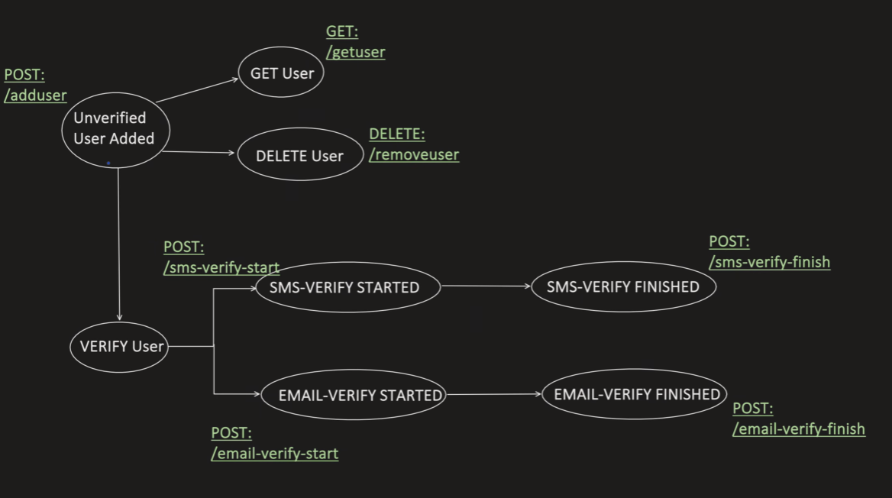

# Spring Boot HATEOAS API

**HATEOAS**: **H**ypermedia **A**s **T**he **E**ngine Of **A**pplication **S**tate <br>
It tells the client, what the next action you can perform after particular step.


API Response, after "Unverified User Added" -- POST: /addUser API
### Without HATEOAS Link
```json
{
  "userID": "124567",
  "name": "SJ",
  "verifyStatus": "UNVERIFIED"
}
```

### With HATEOAS Link
```json
{
  "userID": "134567",
  "name": "SJ",
  "verifyStatus": "UNVERIFIED",
  "links": [
    {
      "rel": "self",
      "href": "http://localhost:8080/api/getUser",
      "type": "GET"
    }
  ]
}
```

When to use and why to use HATEOAS Link? <br>
2 Major Purpose of using HATEOAS Link is to achieve:
- **Loose Coupling**
- **API Discovery**

To achieve above, server provides the next set of APIs (actions) in the response itself, which client can take. So that client have less business logic around APIs (which API to invoke, when to invoke, how to invoke, etc..)

However, adding all next set of Actions can make our API response bloated, and has several disadvantages:
- Increase complexity at server side
- Latency impact
- Increase payload size

Never, ever add all possible next set of actions,just like that
```json
{
  "userID": "134567",
  "name": "SJ",
  "verifyStatus": "UNVERIFIED",
  "links": [
    {
      "rel": "self",
      "href": "http://localhost:8080/api/getUser/12356",
      "type": "GET"
    },
    {
      "rel": "remove",
      "href": "http://localhost:8080/api/getUser/12356",
      "type": "DELETE"
    },
    {
      "rel": "update",
      "href": "http://localhost:8080/api/getUser/12356",
      "type": "PATCH"
    },
    {
      "rel": "verify-start",
      "href": "http://localhost:8080/api/getUser/12356",
      "type": "POST"
    },
    {
      "rel": "verify-finish",
      "href": "http://localhost:8080/api/getUser/12356",
      "type": "POST"
    }
  ]
}
```

Proper analysis needs to be done, what actually help us to achieve **Loose Coupling** <br>
Now, if we check the above diagram again.

As we can see, the tight coupling lies during VERIFY process. <br>
Client need some info, before it can decide which verify API to invoke. For example: <br>
```json
{
  "userID": "123456",
  "name": "SJ",
  "verifyStatus": "UNVEIRIFED",
  "verifyType": "SMS",
  "verifyState": "NOT_YET_STARTED"
}
```

Client need to put the business logic, that
```java
if(verifyStatus == "UNVERIFIED") {
    if(verifyType == "SMS") {
        if(verifyState == "NOT_YET_STARTED") {
            //Call Post: /sms-verify-state
        } else if (verifyState == "STARTED") {
            //Call Post: /sms-verify-finish
        }
    } else if (verifyType == "EMAIL"){
        if(verifyState == "NOT_YET_STARTED") {
        //Call Post: /sms-verify-state
        } else if (verifyState == "STARTED") {
        //Call Post: /sms-verify-finish
        }
    }
}
```

This dependency, can be removed by HATEOAS Link:
```json
{
  "userID": "134567",
  "name": "SJ",
  "verifyStatus": "UNVERIFIED",
  "links": [
    {
      "rel": "verify",
      "href": "http://localhost:8080/api/sms-verify-finish/12346",
      "type": "POST"
    }
  ]
}
```

Now, we have achieved Loose Coupling and client code looks like this:
```java
if(verifyStatus == "UNVERIFIED") {
    //invoke the veridy URI, given in HATEOAS link
}
```

Add dependency
```xml
<dependency>
    <groupId>org.springframework.boot</groupId>
    <artifactId>spring-boot-starter-hateoas</artifactId>
    <version>2.6.4</version>
</dependency>
```

```java
@RestController
@RequestMapping(value = "/api")
public class UserController {
    @Autowired
    private User user;
    
    @PostMapping(path = "/addUser")
    public ResponseEntity<UserResponse> addUser() {
        UserResponse response = user.getUser();
        //our business logic to determine which verify API need to be invoked
        Link verifyLink = WebMvcBuilder.linkTo(UserController.class)
                .slash("sms-verify-finish")
                .slash(response.getUserID())
                .withRel("verify")
                .withType("POST");
        
        response.addLink(verifyLink);
        return new ResponseEntity<>(response, HttpStatus.OK);
    }
}
```

```java
public class HateosLinks {
    private List<Link> links = new ArrayList<>();
    public void addLink(Link link) {
        links.add(link);
    }
}
```

```java
public class UserResponse extends HateosLinks {
    private String userID;
    private String name;
    private String verifyStatus;
    //getters and setters
}
```

-------------------------------------------------

## Introduction
HATEOAS (Hypermedia as the Engine of Application State) is a key concept in RESTful API design, introduced as part of REST by Roy Fielding. It provides a way for a client to dynamically discover and navigate the API's resources through links embedded in the responses, rather than relying solely on predefined knowledge of URIs.

In a Spring Boot application, HATEOAS is implemented using the Spring HATEOAS library, which simplifies the creation of hypermedia-driven APIs.

### Key Concepts of HATEOAS
1. **Hypermedia**: Responses from the server include links that guide the client on what actions are available next and how to perform them.
2. **Self-Descriptive Messages**: Each resource representation includes metadata and relationships to other resources.
3. **Dynamic Navigation**: Clients navigate the API by following links, reducing the need for hardcoded URL paths in client applications.

### Benefits of HATEOAS
- **Discoverability**: Clients can dynamically discover available operations, making the API self-documenting.
- **Flexibility**: Changes in resource URLs or structures don't break clients, as they rely on links provided dynamically.
- **Scalability**: It encourages a consistent way of interacting with resources, even as the API grows in complexity.

### Components of Spring HATEOAS
1. **ResourceSupport**: A base class providing support for hypermedia links.
2. **EntityModel**: Represents a single resource and its associated links.
3. **CollectionModel**: Represents a collection of resources with links.
4. **Link**: Represents a hypermedia link, including a relation (rel) and a URI.

### Implementing HATEOAS in Spring Boot
#### 1. Add Spring HATEOAS Dependency
```xml
<dependency>
    <groupId>org.springframework.boot</groupId>
    <artifactId>spring-boot-starter-hateoas</artifactId>
</dependency>

```

#### 2. Define a Resource Model
```java
import org.springframework.hateoas.EntityModel;
import org.springframework.hateoas.Link;
import static org.springframework.hateoas.server.mvc.WebMvcLinkBuilder.*;

@Entity
public class Employee {
    private Long id;
    private String name;
    private String role;

    // Getters and Setters
}

public class EmployeeModel extends EntityModel<Employee> {
    public EmployeeModel(Employee employee) {
        super(employee);

        // Add a self-link
        add(linkTo(methodOn(EmployeeController.class).getEmployee(employee.getId())).withSelfRel());

        // Add a link to all employees
        add(linkTo(methodOn(EmployeeController.class).getAllEmployees()).withRel("employees"));
    }
}

```

#### 3. Controller with HATEOAS Links
```java
import org.springframework.hateoas.CollectionModel;
import org.springframework.hateoas.EntityModel;
import org.springframework.web.bind.annotation.*;

import java.util.List;
import java.util.stream.Collectors;

@RestController
@RequestMapping("/employees")
public class EmployeeController {

    @GetMapping("/{id}")
    public EntityModel<Employee> getEmployee(@PathVariable Long id) {
        Employee employee = employeeService.findById(id);

        // Wrap the employee in an EntityModel and return
        return new EmployeeModel(employee);
    }

    @GetMapping
    public CollectionModel<EntityModel<Employee>> getAllEmployees() {
        List<EntityModel<Employee>> employees = employeeService.findAll().stream()
                .map(EmployeeModel::new)
                .collect(Collectors.toList());

        // Add a self-link for the collection
        return CollectionModel.of(employees, linkTo(methodOn(EmployeeController.class).getAllEmployees()).withSelfRel());
    }
}

```

#### 4. Example Response with Hypermedia Links
```json
{
  "id": 1,
  "name": "John Doe",
  "role": "Developer",
  "_links": {
    "self": {
      "href": "http://localhost:8080/employees/1"
    },
    "employees": {
      "href": "http://localhost:8080/employees"
    }
  }
}

```

### Best Practices for HATEOAS
1. **Consistent Use of Links**: Ensure every resource includes relevant links.
2. **Meaningful Relation Names**: Use meaningful rel attributes to describe the purpose of the link (e.g., self, employees, update).
3. **Pagination**: For collections, include links for pagination (e.g., next, prev, first, last).
4. **Error Handling**: Return appropriate hypermedia links for error scenarios where applicable.